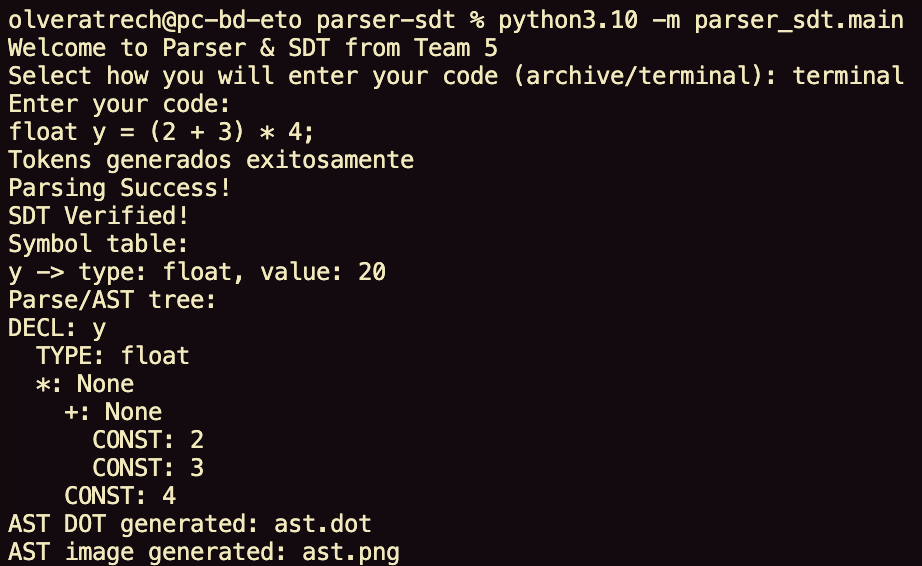
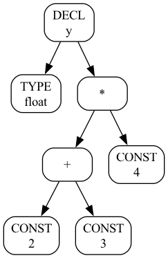
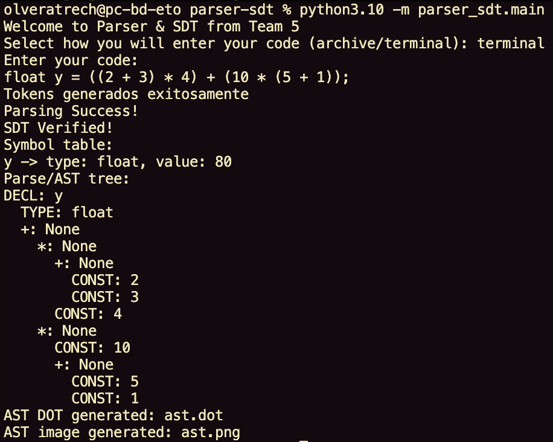
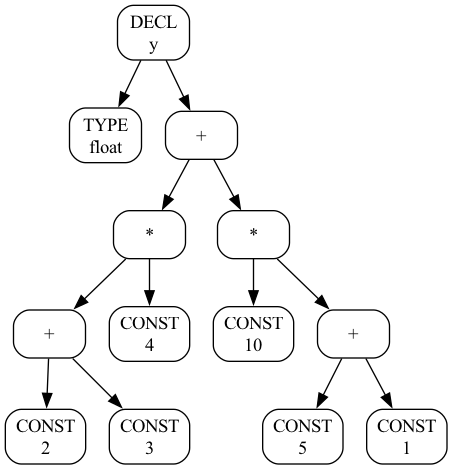
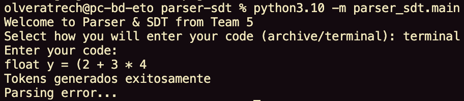
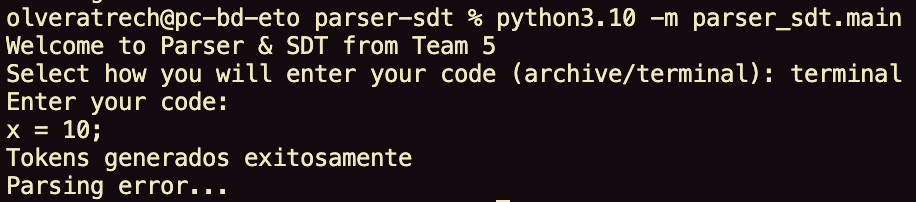
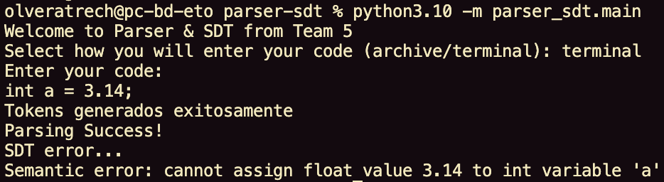
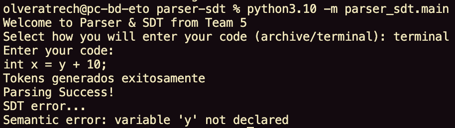

::::::::::::: titlepage
:::::::::::: center
::::: minipage
::: center
{width="4.5cm"}
:::

::: center
**Universidad Nacional Autónoma de México**
:::
:::::

:::: minipage
::: center
Ingeniería en Computación
:::
::::

::: center
Compilers
:::

:::: center
Parser and SDT\

::: center
STUDENTS:\
321184995\
321331656\
321058526\
424138220\
320560154
:::

Group:\
#05\
Semester:\
2026-II
::::

::: center
México, CDMX. April 30th, 2025\
:::
::::::::::::
:::::::::::::

# Introduction

In the construction of a compiler, one of the most critical phases after
lexical analysis is syntax analysis (parsing) and semantic analysis. The
lexical analyzer converts a source code string into a stream of tokens,
but it does not verify whether the sequence of tokens follows the
grammatical structure of the programming language, nor does it enforce
semantic rules such as type consistency or variable declaration before
use.

The specific problem addressed in this work is the implementation of a
syntax and semantic analyzer that:

- Receives a sequence of tokens from a lexical analyzer.

- Determines whether the token sequence conforms to a context-free
  grammar defining the source language.

- Performs syntax-directed translation to verify semantic rules and
  build auxiliary structures such as the symbol table and the abstract
  syntax tree.

The input language is limited but realistic: it supports variable
declarations (e.g., *float y*, *int x*), arithmetic expressions with
parentheses and operators and assignment statements terminated by a
semicolon. The compiler stops after semantic validation.

Understanding how a compiler verifies the correctness of a program
before executing it is fundamental in computer engineering. While lexers
are relatively simple, parsing and semantic analysis pose significant
challenges: handling recursion, precedence, associativity, and
context‑sensitive constraints.

Implementing a bottom‑up LALR parser from first principles --- without
relying on parser generators like Yacc or ANTLR --- provides deep
insight into:

- How LR automata work (states, goto, action tables).

- How shift‑reduce parsing uses explicit stacks to simulate a
  deterministic pushdown automaton.

- How syntax‑directed translation can be embedded into the parsing
  process to perform semantic checks and construct intermediate
  representations.

Furthermore, this project demonstrates the synergy between theoretical
concepts and practical software engineering.

## General Objective: {#general-objective .unnumbered}

Develop a functional syntax and semantic analyzer that, given a token
stream from a lexical analyzer, verifies grammatical correctness,
executes syntax‑directed translation rules, and produces a symbol table
and an abstract syntax tree.

## Specific Objectives: {#specific-objectives .unnumbered}

1.  Define a context‑free grammar that describes the subset of the
    source language (declarations, expressions, assignments).

2.  Construct an LALR parsing table from the grammar using closure,
    goto, first sets, and item set construction.

3.  Implement a shift‑reduce parser using two stacks (states and
    symbols) that simulates an LR automaton.

4.  Augment the grammar with SDT rules to:

    - Check that variables are declared before use.

    - Verify type compatibility in assignments and expressions.

    - Build a symbol table.

    - Build an AST representing the structure of each statement.

5.  Provide clear output messages indicating:

    - Parsing success/failure.

    - SDT verification success/failure.

    - Symbol table and a graphic AST.

# Theoretical Framework

This section presents the compiler concepts applied in our
implementation, directly referencing our code structure.

## Lexical Analysis

The lexer converts source code into a stream of tokens. Our lexer uses
**regular expressions** defined in the token list. Each regex pattern is
matched sequentially against the input string.

**Key concepts:**

- **Tokens**: pairs of (type, value) e.g., `(’keyword’, ’float’)`,
  `(’identifier’, ’y’)`

- **Pattern matching**: each pattern is tried until a match is found

- **Whitespace and comments**: patterns with token type `None` are
  ignored

- The lexer returns an error if an invalid character is found

In our code, the `tokenize()` function scans line by line, column by
column, building the token list.

## Grammar Definition

A **CFG** defines the syntactic structure of our language. We use the
following grammar:

$$\begin{array}{lcl}
        S' & \rightarrow & S \\
        S & \rightarrow & D \; ; \\
        D & \rightarrow & \text{TYPE} \; \text{ID} \; = \; E \\
        E & \rightarrow & E \; + \; T \;\;|\;\; T \\
        T & \rightarrow & T \; * \; F \;\;|\;\; F \\
        F & \rightarrow & ( \; E \; ) \;\;|\;\; \text{ID} \;\;|\;\; \text{CONST}
    \end{array}$$

**Terminals** (tokens from lexer): {`TYPE`, `ID`, `CONST`, `=`, `;`,
`+`, `*`, `(`, `)`, `$`}\
**Non-terminals**: {`S’`, `S`, `D`, `E`, `T`, `F`}

## LR(1) Items and Closure

An **LR(1) item** is a production with a dot ($\bullet$) indicating how
much we have parsed, plus a lookahead terminal. Example:

$$E \rightarrow E \; \bullet \; + \; T \quad , \quad \text{lookahead} = \{ \$, +, ) \}$$

The **closure operation** (implemented in `cierre_lr1()`) expands a set
of items:

1.  Start with the initial set of items

2.  If the dot is before a non-terminal $B$, add all productions of $B$
    with the dot at the beginning

3.  Calculate lookaheads using FIRST sets

4.  Repeat until no new items can be added

## FIRST Sets

FIRST($\alpha$) is the set of terminals that can begin strings derived
from $\alpha$.

**Calculation algorithm in our code**:

1.  Initialize FIRST(terminal) = {terminal}

2.  Iteratively propagate FIRST sets through productions

3.  For a string of symbols, FIRST is the union of FIRST of each symbol
    until $\varepsilon$ is not found

This is essential for computing lookaheads in LR(1) items.

## GOTO and State Construction

The **GOTO** function moves the dot past symbol $X$:
$$\text{goto}(I, X) = \text{closure}(\{ A \rightarrow \alpha X \bullet \beta , a \mid A \rightarrow \alpha \bullet X \beta , a \in I \})$$

Our code builds all LR(1) states:

1.  Start with $\text{closure}(\{S' \rightarrow \bullet S, \$\})$

2.  For each state and each symbol $X$, compute $\text{goto}(state, X)$

3.  Add new states until no new states appear

## LALR Table Construction

**LALR** merges LR(1) states with identical **cores**. This produces a
smaller parsing table than full LR(1).

**Our algorithm:**

1.  Build full LR(1) states

2.  Group states by their core

3.  Merge lookaheads from all items in the same core group

4.  Build ACTION table (shift/reduce/accept) and GOTO table

**ACTION table entries:**

- `S{n}`: shift to state $n$

- `R{n}`: reduce by production number $n$

- `acc`: accept

**GOTO table**: after reducing to non-terminal $X$ in state $i$, go to
state $j$

## Shift-Reduce Parsing

The parser simulates an LR automaton using **two stacks**:

  **Stack**    **Content**          **Purpose**
  ------------ -------------------- -------------------------
  `pila`       states               LR automaton states
  `pila_sem`   AST nodes / values   Semantic values for SDT

**Parsing loop:**

1.  Look at current state and input token

2.  Consult ACTION table:

    - **Shift** ($S\{n\}$): push token and state $n$, advance input

    - **Reduce** ($R\{n\}$): pop $2 \times |\text{rhs}|$ from state
      stack, pop $|\text{rhs}|$ from semantic stack, execute semantic
      action, push result, consult GOTO table

    - **Accept** (acc): successful parse

## Syntax-Directed Translation

**SDT** attaches semantic actions to grammar productions. These actions
execute during reductions to:

- Build the **AST**

- Manage the **symbol table**

- Verify semantic rules

**Our semantic actions** (implemented in `accion_semantica()`):

  **Production**                       **Action**
  ------------------------------------ -----------------------------------------------------
  $D \rightarrow \text{TYPE ID} = E$   Declare variable, evaluate expression, assign value
  $E \rightarrow E + T$                Create $+$ AST node
  $T \rightarrow T * F$                Create $*$ AST node
  $F \rightarrow \text{ID}$            Create ID AST node with variable name
  $F \rightarrow \text{CONST}$         Convert constant to numeric value

## AST Construction

The **Abstract Syntax Tree** discards syntactic noise (like parentheses,
semicolons) while preserving program structure.

**Node types in our AST:**

- `CONST`: numeric literal value

- `ID`: variable reference

- `+`: addition operation

- `*`: multiplication operation

- `DECL`: declaration node

## Symbol Table

The **symbol table** stores information about variables:

- **Name** (identifier)

- **Type** (from TYPE token)

- **Value** (initialization value, if any)

**Operations:**

- `declarar(nombre, tipo)`: insert new variable, raises error if already
  declared

- `asignar(nombre, valor)`: set value, raises error if not declared

- `obtener(nombre)`: retrieve variable info, raises error if not
  declared

## Semantic Validation

Our SDT performs three semantic checks:

1.  **Declaration before use**: `obtener()` raises error if variable not
    in symbol table

2.  **Type consistency**: declaration stores the type; expression
    evaluation returns numeric values

3.  **Initialization before use**: `evaluarexpresion()` checks that
    variable has a value (not None)

## Error Handling

The system distinguishes three error scenarios:

  **Parsing**     **SDT**         **Output**
  --------------- --------------- ----------------------------------
  $\times$ Fail   ---             `Parsing error...`
  Success         $\times$ Fail   `Parsing Success! SDT error...`
  Success         Pass            `Parsing Success! SDT Verified!`

This matches the requirement that parsing may succeed while semantic
validation fails.

## References

- Aho, A. V., Lam, M. S., Sethi, R., & Ullman, J. D. (2006). *Compilers:
  Principles, Techniques, and Tools* (2nd ed.). Addison-Wesley.

- Appel, A. W. (2002). *Modern Compiler Implementation in Java* (2nd
  ed.). Cambridge University Press.

# Development

## Implementation Description

The implementation follows a modular architecture with clear separation
of concerns, consisting of three independent modules that communicate
through well-defined interfaces.

### Lexer Module (lexer/)

Responsible for reading the source code from either a file or direct
terminal input. It scans the input character by character, matches
recognized patterns using regular expressions, and produces a stream of
tokens. Each token is represented as a pair consisting of a token type
(e.g., `keyword`, `identifier`, `constant`, `operator`, `punctuation`)
and its corresponding lexeme. The lexer ignores whitespace and comments,
and stops with an error when an invalid character is encountered.

### Parser and SDT Module (parser_sdt/)

This module contains the core of the syntactic and semantic analysis. It
is composed of several components:

- **Grammar definition**: The context-free grammar is hardcoded as a
  list of productions, where each production has a left-hand side
  (non-terminal) and a right-hand side (sequence of terminals and
  non-terminals).

- **Parsing table construction**: The LALR parsing table is built
  programmatically. The algorithm first computes FIRST sets for all
  grammar symbols, then constructs the complete set of LR(1) states
  using the closure and goto operations. Subsequently, states with
  identical cores are merged to obtain the LALR(1) collection. From this
  collection, the ACTION and GOTO tables are generated, where each entry
  specifies a shift, reduce, or accept action.

- **Shift-reduce parser**: The parsing algorithm uses two stacks: a
  state stack that simulates the LR automaton, and a semantic stack that
  stores partial AST nodes and values. The parser consults the ACTION
  table at each step to decide whether to shift (consume a token and
  push a new state) or reduce (apply a production, pop the corresponding
  number of elements, and execute a semantic action).

- **Syntax-Directed Translation**: Semantic actions are attached to each
  grammar production. These actions are executed during reductions and
  are responsible for constructing the AST, managing the symbol table,
  and performing semantic validation. The AST is built as a tree of
  nodes, where each node represents an operation (addition,
  multiplication), a constant value, or a variable reference. The symbol
  table stores variable names, their declared types, and their assigned
  values.

### Integration

The main program orchestrates the entire process. It prompts the user to
select the input source *file* or *terminal*, invokes the lexer to
obtain the token stream, and then passes the tokens to the parser. The
parser returns a success or failure status, and in case of success, it
displays the symbol table and the AST.

## Testing and Outputs

The system was tested with multiple input scenarios to verify both
syntactic correctness and semantic validation. Below are the
representative test cases and their corresponding outputs.

### Test Case 1: Valid Declaration and Simple Expression

**Input:**

                            float y = (2 + 3) * 4;

**Output:**

                            Parsing Success!
                            SDT Verified!
                            
                            Symbol table:
                            y -> type: float, value: 20
                            
                            AST:
                            DECL: y
                                    TYPE: float
                                    *: None
                                            +: None
                                                    CONST: 2
                                                    CONST: 3
                                            CONST: 4

**Explanation:** The parser correctly recognizes the declaration,
evaluates the arithmetic expression following precedence rules
(parentheses first, then multiplication, then addition), stores the
variable in the symbol table with its type and computed value, and
builds the corresponding AST.

### Test Case 2: Valid Declaration with Nested Expressions

**Input:**

                            float y = ((2 + 3) * 4) + (10 * (5 + 1));

**Output:**

                            Parsing Success!
                            SDT Verified!
                            
                            Symbol table:
                            y -> type: float, value: 80
                            
                            AST:
                            DECL: y
                                    TYPE: float
                                    +: None
                                            *: None
                                                    +: None
                                                            CONST: 2
                                                            CONST: 3
                                                    CONST: 4
                                            *: None
                                                    CONST: 10
                                                    +: None
                                                            CONST: 5
                                                            CONST: 1

**Explanation:** This test case evaluates a more complex expression with
nested parentheses and multiple operators. The expression is computed as
$((2 + 3) \times 4) + (10 \times (5 + 1)) = (5 \times 4) + (10 \times 6) = 20 + 60 = 80$.
The AST correctly reflects the hierarchical structure, showing that
addition is the root operation with two multiplication subtrees.
Parentheses are properly handled and do not appear as nodes in the AST.

### Test Case 3: Syntax Error - Missing Parenthesis and Semicolon

**Input:**

                            float y = (2 + 3 * 4

**Output:**

                            Parsing error...

**Explanation:** The input is missing the closing parenthesis and the
semicolon. The parser detects the syntax error during the shift-reduce
process because no valid action is defined for the current state and
input token.

### Test Case 4: Semantic Error - Variable Not Declared

**Input:**

                            x = 10;

**Output:**

                            Parsing error...

**Explanation:** The grammar only accepts declarations of the form TYPE
ID=E;. Since the input x = 10; lacks a TYPE keyword, the parser cannot
find a valid sequence of reductions to reach the start symbol S.
Therefore, a syntax error is reported and the semantic actions are never
executed.

### Test Case 5: Semantic Error - Type Mismatch

**Input:**

                            int a = 3.14;

**Output:**

                            Parsing Success!
                            SDT error...
                            Semantic error: cannot assign float value 3.14 to int variable 'a'

**Explanation:** Although the syntax is valid, the semantic action
detects that an integer variable is being assigned a floating-point
constant, which violates the type consistency rule.

### Test Case 6: Semantic Error - Variable Used Before Declaration

**Input:**

                            int x = y + 10;

**Output:**

                            Parsing Success!
                            SDT error...
                            Semantic error: variable 'y' not declared

**Explanation:** The syntax is correct because the input follows the
production $D \rightarrow \text{TYPE} \; \text{ID} \; = \; E$. The
parser successfully reduces the input to $S$. However, during the
semantic action for this production, the expression $y + 10$ is
evaluated. The function `evaluarexpresion()` attempts to retrieve the
value of variable `y` from the symbol table, but `y` has not been
declared. This triggers a semantic error, and the SDT fails even though
parsing succeeded.

All implemented requirements have been satisfied. The parser correctly
validates syntax according to the defined grammar, and the SDT
successfully enforces semantic rules while building the symbol table and
AST. The system correctly distinguishes between parsing errors and
semantic errors, as required in the project specifications.

# Results

This section presents the results obtained from executing the syntax and
semantic analyzer on the test cases described in the Development
section. The evaluation focuses on verifying that the system correctly
distinguishes between syntactically valid and invalid inputs, as well as
between successful and failed semantic validation.

The system was tested with six input scenarios. For each test case, the
output was recorded and analyzed. The following subsections show the
actual outputs obtained from the program execution.

## Valid Test Cases

### Test Case 1: Valid Declaration and Simple Expression

Figure [\[fig:test1\]](#fig:test1){reference-type="ref"
reference="fig:test1"} shows the output generated by the system for the
input `float y = (2 + 3) * 4;`. The parser reports success, the SDT
verification passes, and the symbol table displays the variable `y` with
type `float` and value `20`. The AST is also printed in a hierarchical
format.

<figure id="fig:test1_ast" data-latex-placement="ht">

<figcaption>AST for Test Case 1</figcaption>
</figure>

### Test Case 2: Valid Declaration with Nested Expressions

Figure [\[fig:test2\]](#fig:test2){reference-type="ref"
reference="fig:test2"} shows the output generated for the input
`float y = ((2 + 3) * 4) + (10 * (5 + 1));`. The expression is correctly
evaluated to 80, and the AST reflects the nested structure of the
operations.

Figure [2](#fig:test2_ast){reference-type="ref"
reference="fig:test2_ast"} shows the corresponding AST, where the root
node is addition (`+`) with two multiplication subtrees.

<figure id="fig:test2_ast" data-latex-placement="ht">

<figcaption>AST for Test Case 1</figcaption>
</figure>

## Invalid Test Cases

### Test Case 3: Syntax Error - Missing Parenthesis and Semicolon

For the input `float y = (2 + 3 * 4`, the system reports a parsing
error. The parser cannot complete the reduction because the input does
not conform to the grammar.

<figure id="fig:test3" data-latex-placement="ht">

<figcaption>Output for Test Case 3: syntax error</figcaption>
</figure>

### Test Case 4: Syntax Error - Assignment Without TYPE Keyword

For the input `x = 10;`, the system also reports a parsing error. Since
the grammar requires a `TYPE` keyword at the beginning of every
statement, this input is syntactically invalid.

<figure id="fig:test4" data-latex-placement="ht">

<figcaption>Output for Test Case 4: assignment without TYPE
keyword</figcaption>
</figure>

### Test Case 5: Semantic Error - Type Mismatch

For the input `int a = 3.14;`, the parsing succeeds but the SDT fails
because an integer variable cannot be initialized with a floating-point
constant.

<figure id="fig:test5" data-latex-placement="ht">

<figcaption>Output for Test Case 5: type mismatch</figcaption>
</figure>

### Test Case 6: Semantic Error - Variable Used Before Declaration

For the input `int x = y + 10;`, the parsing succeeds but the SDT fails
because the variable `y` has not been declared in the symbol table.

<figure id="fig:test6" data-latex-placement="ht">

<figcaption>Output for Test Case 6: variable used before
declaration</figcaption>
</figure>

## Summary of Results

Table [1](#tab:summary){reference-type="ref" reference="tab:summary"}
presents a consolidated summary of all test cases, indicating whether
parsing succeeded, whether SDT verification passed, and the final output
message.

::: {#tab:summary}
  **Test Case**                               **Parsing**   **SDT**    **Output**
  ------------------------------------------- ------------- ---------- ----------------------------------
  Valid declaration and simple expression     Success       Verified   `Parsing Success! SDT Verified!`
  Valid declaration with nested expressions   Success       Verified   `Parsing Success! SDT Verified!`
  Missing parenthesis and semicolon           Error         ---        `Parsing error...`
  Assignment without TYPE keyword             Error         ---        `Parsing error...`
  Type mismatch (int = float)                 Success       Error      `Parsing Success! SDT error...`
  Variable used before declaration            Success       Error      `Parsing Success! SDT error...`

  : Summary of test results
:::

# Conclusions

The development of this syntax and semantic analyzer demonstrates the
successful application of theoretical compiler concepts to a functional
implementation. The results presented in Section 4 show that the LALR
parser correctly validates the syntactic structure of the input language
according to the defined context-free grammar, while the SDT effectively
enforces semantic rules and builds auxiliary structures such as the
symbol table and the abstract syntax tree.

The implementation confirms that bottom-up parsing using an LALR(1)
table, constructed from first principles via closure, goto, and state
merging, is a viable approach for languages with deterministic
context-free grammars. The shift-reduce algorithm, combined with two
stacks (states and semantic values), faithfully simulates the LR
automaton and provides a natural integration point for syntax-directed
translation.

The distinction between parsing errors and semantic errors, as shown in
the test cases, validates the modular separation of concerns within the
compiler pipeline. Syntactic errors are detected and reported by the
parser before any semantic action is executed, while inputs that are
syntactically correct but violate semantic rules (type mismatches,
undeclared variables, use before initialization) are properly caught by
the SDT during reduction actions. This separation is essential for
building robust compilers that provide meaningful feedback to the user.

The construction of the AST and the symbol table during the parsing
process demonstrates how context-sensitive information can be embedded
into a context-free grammar framework. The AST abstracts away irrelevant
syntactic details (parentheses, semicolons) while preserving the
hierarchical structure of operations, which is a necessary step for
subsequent phases such as intermediate code generation and optimization.

In summary, the theoretical concepts covered in class---LR items,
closure, goto, FIRST sets, LALR table construction, shift-reduce
parsing, and syntax-directed translation---were directly applied to
build a working analyzer. The system meets all the specified
requirements: it reads tokens from a lexical analyzer, validates syntax
according to a CFG, executes SDT rules, and produces a symbol table and
an AST. The results confirm that a bottom-up LALR parser with integrated
semantic actions can be implemented from scratch without relying on
parser generators, providing a deep understanding of how compilers
verify program correctness at both the syntactic and semantic levels.
